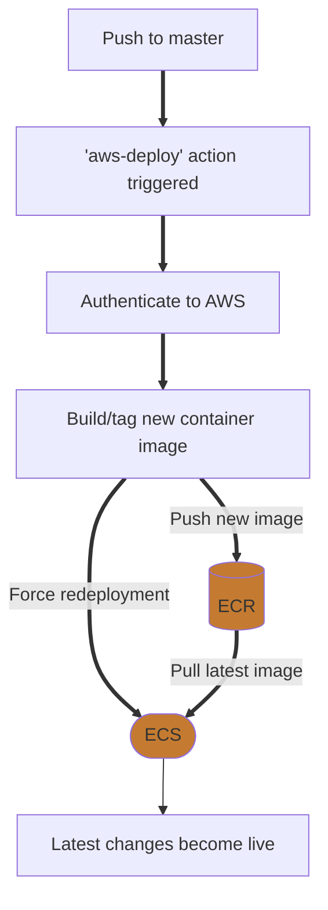

# ShamBot

An exercise in setting up a nodejs application the 'proper' way with AWS, Docker, and more. The actual 'bot' is very simple with two commands, giving points to other users and checking how many points someone has.

## Infrastructure

### AWS

ShamBot runs on AWS ECS (Elastic Container Service). This means we can define a _task_ (running the ShamBot container) and have AWS handle deploying it. However, we still need to assign it to a _service_ and a _cluster,_ so that AWS knows what resources (EC2 types) to use.

AWS ECR is a registry for container images that we use to store the latest ShamBot image. ECS will pull from this registry when deploying the service.

### Environment Variables

Using environment variables it is very easy to configure a production bot and a development bot, and have them running simultaneously.

### Database

There is a Postgres RDS instance running on AWS used by the production bot, and when developing locally `docker-compose` will spin up a Postgres image for testing.

### Deployment Process

## Local development

1. Install nodejs `16.17.0` (if running locally)

2. Install docker

3. Setup required environment variables:

| Env Var            | Description                                            |
|--------------------|--------------------------------------------------------|
| `SHAMBOT_TOKEN`    | Discord bot token                                      |
| `SHAMBOT_CLIENTID` | Discord application/clientid (they are the same thing) |
| `SHAMBOT_PG_USER`  | Postgres user                                          |
| `SHAMBOT_PG_PASS`  | Postgres password                                      |
| `SHAMBOT_PG_HOST`  | Postgres host (`localhost` when developing)            |

_Helpful string for IntelliJ environment configurations:_

`SHAMBOT_CLIENTID=123ABC;SHAMBOT_PG_PASS=123ABC;SHAMBOT_PG_USER=123ABC;SHAMBOT_TOKEN=123ABC;SHAMBOT_PG_HOST=localhost;`

4. Run `docker compose up` (use `--build` to ensure changes take effect)

## How to deploy

1. Push to master
2. It will automatically build the image, push it to AWS, and rerun the bot